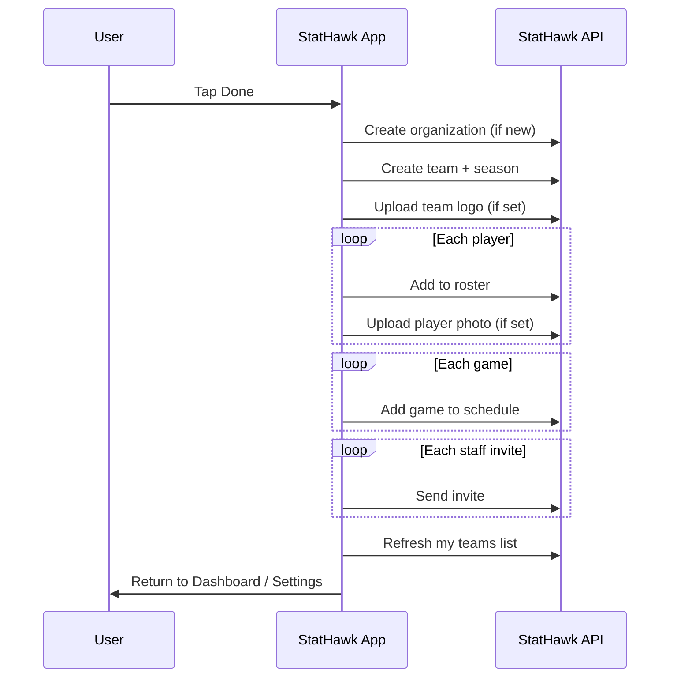

# StatHawk — Team Creation Workflow

**Product:** StatHawk iOS app + backend API  
**Feature:** Create New Team (4-step wizard)  
**Status:** Implemented end-to-end  
**Date:** May 2026

---

## Executive Summary

Team creation is a guided, four-step wizard in the iOS app. The team is **not saved to the server until the user taps Done** on the final step (Settings). Until then, team info, roster, schedule, and staff invites are held on the device (with partial draft recovery if the user leaves and returns).

When the user finishes:

1. The team and season are created on the server.
2. The creator becomes **Team Owner** with full admin access.
3. Roster players, games, and optional team logo are uploaded.
4. Staff invitations are sent by email (for people who do not yet have a StatHawk account).
5. The new team appears on the **Dashboard** team picker and under **Settings → My Teams**.

---

## Where Users Start

| Entry point | Action |
|-------------|--------|
| **Dashboard** | “New Team” on the team selection screen |
| **Settings → My Teams** | “New Team” button |

Both open the same **Create New Team** full-screen flow.

---

## Wizard Overview (4 Steps)

```
┌─────────────┐    ┌─────────────┐    ┌─────────────┐    ┌─────────────┐
│  TEAM INFO  │ →  │ ADD PLAYERS │ →  │  SCHEDULE   │ →  │  SETTINGS   │
│  (Continue) │    │  (Continue) │    │ (Continue / │    │    (Done)   │
│             │    │             │    │    Skip)    │    │             │
└─────────────┘    └─────────────┘    └─────────────┘    └─────────────┘
```

Tabs unlock in order. The user cannot jump ahead until they complete the current step with **Continue** (except Schedule, which can be **skipped**).

---

## Step 1 — Team Info

**Purpose:** Define the team identity and season.

| Field | Required | Notes |
|-------|----------|--------|
| Team name | Yes | |
| Season | Yes | Defaults to current season (e.g. 2025–2026) |
| Level | Yes | Youth / high school / college / other |
| Country, state, city | Yes* | State required when country has subdivisions |
| Organization / school | Yes | Search existing orgs or enter a new name |
| Team logo | No | Optional image upload |

**Validation before Continue:** All required fields must be filled; organization must be selected from search or entered as new text.

> **Important:** Tapping **Continue** does **not** create the team on the server yet. It only unlocks the next tab and saves progress locally.

---

## Step 2 — Add Players

**Purpose:** Build the roster before the team exists on the server.

- Each player is added via **Add Player** (name, jersey, positions, optional photo, optional email).
- While creating a new team, players are stored **only on the device** until **Done**.
- Player photos are kept in memory until upload at the end.

> **Note:** If the app is fully closed before **Done**, roster and schedule data added in steps 2–3 are **not** recovered (team info and settings draft may still be restored).

---

## Step 3 — Schedule

**Purpose:** Add games for the season.

- User can add games manually (opponent, date, time, location, etc.).
- **Skip** is available — user can proceed to Settings without any games.
- Games are stored locally until **Done**, then created on the server in batch.

---

## Step 4 — Settings

**Purpose:** Team permissions, staff, and final submission.

### Team Permissions (defaults on)

| Permission | Default | Meaning |
|------------|---------|---------|
| Coaches can edit roster | On | Head/assistant coaches can manage players |
| Parents can view all stats | On | Parent roles see full team stats |
| Players can share stats | On | Players can share their own stats |
| Require approval to join | On | Join requests need admin approval |

### Staff & Invites (during create)

The creator appears as **Owner** on the members list.

Additional roles can be added:

| Role | Examples |
|------|----------|
| Head coach / Assistant | Coaching staff |
| Parent (edit / view) | Family access |
| Player | Roster-linked member |

**During create:** Invites are **queued**, not emailed immediately. The UI states that **invitations will be emailed when you finish creating the team.**

**On Done:** Each queued invite is sent to the server; the backend decides whether to add the person directly or send an invite email (see Invitations below).

### Done button

**Done** runs the full save sequence (see next section). On success:

- The wizard closes.
- **Dashboard** and **Settings → My Teams** refresh to show the new team.

---

## What Happens When the User Taps Done

The app performs these server operations **in order**:



### 1. Organization (if needed)

- If the user picked an existing organization → link to that org.
- If they typed a new org name → create organization, then link.

### 2. Create team & season

- Creates a **team entity** (name, city, level, organization).
- Creates a **season instance** for the selected year (display name, join code, permissions).
- Creates **membership** for the creator: **Owner**, admin, active.

### 3. Team logo (optional)

- Uploaded to cloud storage; URL saved on the team season.

### 4. Roster (each local player)

- Player record + roster assignment (jersey, positions).
- Optional player photo upload.
- If a player email is provided, the system may treat them like an invite (registered users can be linked without email).

### 5. Schedule (each local game)

- Game records with opponent resolution (opponents can be created or matched automatically).

### 6. Staff invitations (each queued invite)

- Processed one by one; see **Invitation behavior** below.

### 7. Refresh team list

- Dashboard and My Teams load teams where the user has **active membership**.

---

## Invitation Behavior

When staff are invited at the end of team creation:

### Already registered in StatHawk (email matches an account)

- User is added to the team **immediately** as a member.
- **No invite email** is sent.
- They see the team after their next login (or immediately if already logged in).

### Not yet registered

- A **team invite** is created (secure token, 7-day expiry).
- An **email** is sent via StatHawk’s email provider with:
  - Team name and personalized greeting
  - **Open in StatHawk** button using app deep link: `stathawk://…`
  - QR code for the same link
  - Plain-text link for copy/paste

### Deep link flow

1. Recipient taps link → opens StatHawk (or App Store if not installed).
2. New users complete **signup** with email/name prefilled from the invite.
3. After login, the invite is **accepted automatically** and they join the team.

### Invite email not configured (dev/staging)

- Invite records are still created in the database.
- Email may be skipped if the mail API key is not set (typical in local dev).

### Partial invite failures

- If some invites fail (invalid email, network error), the **team is still created**.
- The user may see a message listing emails that could not be invited; they can re-invite from team settings later.

---

## Roles & Access After Creation

| Role | Admin? | Typical use |
|------|--------|-------------|
| **Owner** | Yes | Creator; full control |
| Head coach | Yes | Manage roster, members, schedule |
| Assistant | Configurable | Coaching support |
| Parent (edit) | No | Can edit linked player data |
| Parent (view) | No | Read-only family access |
| Player | No | Athlete account |

**Pro status:** New teams start on the **Free** tier. The creator is recorded as **Pro owner** for future upgrades. Archiving teams and certain Pro features require an active Pro subscription (not part of the create wizard).

---

## Data Stored on the Server

After a successful **Done**, the following exist in StatHawk’s database:

| Record | Description |
|--------|-------------|
| Organization | School/club (new or existing) |
| Team entity | Core team identity |
| Team season | Season year, display name, logo, permissions, join code |
| Membership | Creator + any registered invitees |
| Roster assignments | Players linked to this season |
| Games | Schedule entries (if any were added) |
| Team invites | Pending invites for unregistered emails |

---

## User Experience After Creation

1. Wizard closes; user returns to **Dashboard** or **Settings**.
2. **My teams** list includes every team where they have active membership (including the new team).
3. On Dashboard, they can **select the new team** from the team picker to work with that season.
4. Invited staff receive email (if unregistered) or see the team on next app open (if registered).

---

## Draft & Recovery (create in progress)

| Saved locally (can survive leaving the flow) | Not saved if app is killed |
|-----------------------------------------------|----------------------------|
| Team info, season, level, location | |
| Organization selection | |
| Team logo (as draft) | |
| Tab progress | |
| Permission toggles | |
| Queued staff invites (names/emails) | |
| | Roster players |
| | Schedule games |
| | Player photos |

If the user taps **Back** with unsaved changes, they are prompted: **Discard changes?**

---

## Validation & Error Handling

### Client (app)

- Required fields enforced before advancing from Team Info.
- Staff emails must look valid (`@` required); duplicates blocked in the invite queue.
- Errors show as **“Could Not Save Team”** with a readable message.

### Server

- Required team fields validated (name, city, level, season).
- Duplicate jersey numbers on the same team → rejected.
- Duplicate season for the same team entity → rejected (one season instance per team per year).
- Logo upload fails if cloud storage is not configured (environment issue).

> **Known edge case:** If the team is created successfully but a later step (roster, schedule, or invites) fails, the team may already exist on the server. The user should use **Edit Team** or team settings to complete missing data rather than tapping **Done** again.

---

## API Summary (for technical stakeholders)

| Operation | Method | Endpoint |
|-----------|--------|----------|
| Search organizations | GET | `/v1/organizations/search` |
| Create organization | POST | `/v1/organizations` |
| **Create team** | POST | `/v1/teams` |
| Upload team logo | POST | `/v1/teams/:id/logo` |
| Add player | POST | `/v1/teams/:id/roster` |
| Upload player photo | POST | `/v1/teams/:id/roster/:rosterId/photo` |
| Add game | POST | `/v1/teams/:id/games` |
| Invite member | POST | `/v1/teams/:id/invites` |
| List my teams | GET | `/v1/teams` |

All authenticated endpoints require a signed-in StatHawk user (Clerk JWT).

---

## Testing Checklist (for client QA)

- [ ] Create team with minimum fields (no logo, no players, skip schedule, no invites) → appears on Dashboard and My Teams
- [ ] Create team with logo, 3 players, 2 games, 2 staff invites (one existing user email, one new email)
- [ ] Existing user: no email, appears on their team list after login
- [ ] New user: receives email, deep link opens app, signup prefilled, joins team after login
- [ ] Skip schedule → team still created
- [ ] Discard changes on Back → draft cleared as expected
- [ ] Leave mid-flow and return → team info restored; roster/schedule not restored
- [ ] Duplicate season for same team name/org → appropriate error

---

## Summary for Stakeholders

Team Creation is a **single-session wizard** that batches all work until **Done**, keeping the experience simple for coaches while ensuring the server receives a consistent team, roster, schedule, and invitations in one coordinated flow. **Registered users are onboarded instantly; unregistered users get branded email invites with deep links into signup and team join.** The creator is always **Owner** with full control, and the new team is visible everywhere the app lists “my teams.”
